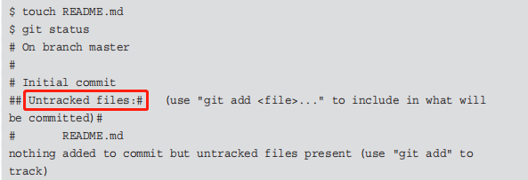
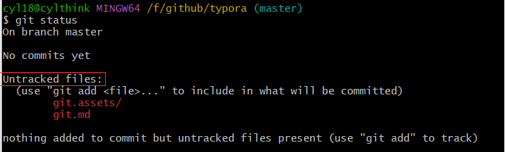
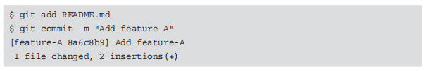
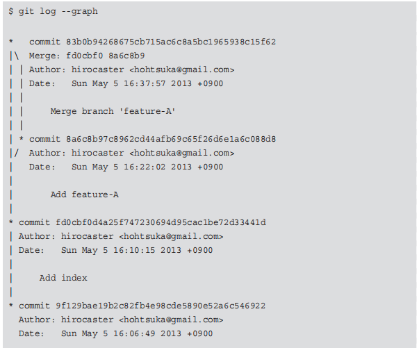
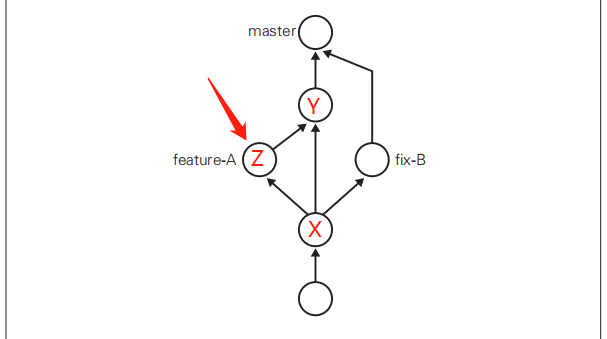
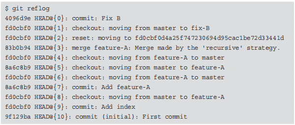

[TOC]

# git

```
git init		//初始化仓库，生成附属该仓库的工作树

git status		//查看仓库的状态
touch README.md	//创建.md文件，未加入暂存区，状态如下(git add)
```





```
git add README.md	//加入暂存区
```

```
git commit -m "add my comment"	//可以将暂存区的文件保存到仓库的历史记录中
```


```
git log						//查看仓库提交的日志，只能查看以当前节点为重点历史
git log --pretty=short		//查看简述信息
git log README.md			//查看指定文件日志
git log -p README.md		//查看指定文件提交日志前后的差别
```

```
git diff			//查看当前工作树与暂存区的区别，如果未使用add命令，则显示与最新提交的区别
git diff HEAD		//查看工作树和最新提交的区别
```

## 分支

```
git branch				//显示分支
```

```
git checkout -b name	//创建并切换分支
```

```
git branch name			//创建分支
git checkout name		//切换分支
```



```
git merge --no-off name		//合并分支
```

```
git log --graph				//以图表形式查看分支
							//图中哈希值可以用来回溯
```



## 回溯

```
git reset --hard 特定节点的哈希值	//可以回溯到特定节点
```



> 当前在Z，且未产生分支B，需要先回溯到X，产生分支B，并推进历史到Y，进而合并B分支

```
git relog			//查看当前仓库执行过的操作的日志，与git log不同
```



```
git checkout master
git reset --hard 83b0b94		//即可回溯历史，到达节点Y
```

若合并分支时，产生冲突，需要修改文件，再合并

```
git commit --amend				//可以修改上次提交信息，直接修改并保存即可
```

压缩历史后续再补充，书中4.3节

## 远程仓库

> 创建github远程仓库时，命名要与本地仓库相同，并且不要勾选readme，避免整合时产生问题

```
git remote add origin git@github.com:用户名/仓库名.git	//会将远程仓库的名称设为origin(标识符)
```

```
git push -u origin master		//推送本地仓库到origin远程仓库的master分支
git push -u origin frature_D	//推送到origin的D分支
git push						//后续增加只需要直接push
```

------

```
git clone git@github.com:用户名/仓库名.git
```

> 默认处于master分支下，并且会将远程仓库的标识符自动设置为origin，本地的master分支与远程的master分支内容相同

```
git branch -a			//可以同时查看本地与远程仓库的分支信息
```

```
git checkout -b name_1 origin/feature_D		//将远程仓库的D分支获取到本地的name_1分支，并且会直接切换到name_1分支
```

```
git pull origin featrue_D		//更新本地的D分支
```

> LearnGitBranching图形化学习git操作网站